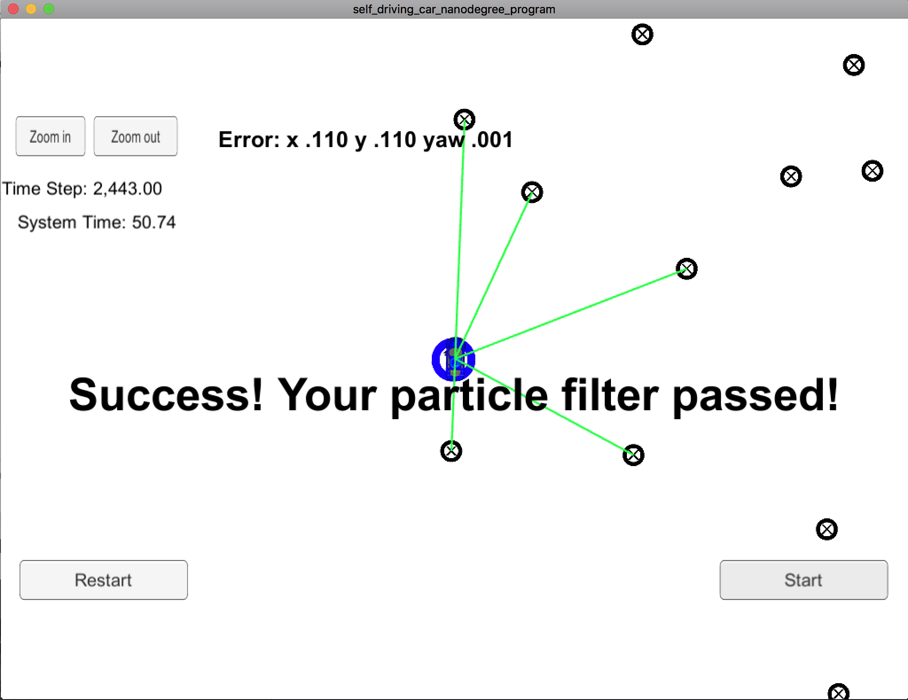

# Kidnapped Vehicle (Particle Filter) Writeup

This assignment basically consisted of filling up `particle_filter.cpp` based on the information from the video lectures.

## Filter Tuning

I opted to initialize the filter with 256 particles, which yields high precision and good performance.

As the filter was lagging behind in y and x axes, I tuned the standard deviations to:

```
double sigma_pos [3] = {1.0, 1.0, 0.02};  
double sigma_landmark [2] = {1.0,1.0};
````

Which yielded very good results.

## Evaluation

The filter runs in the specified time and within the accuracy constraints given by the project.

Final error values were .110, .110, .001 for x,y and yaw, respectively.

Here is a screenshot of the simulator after running on my filter:


